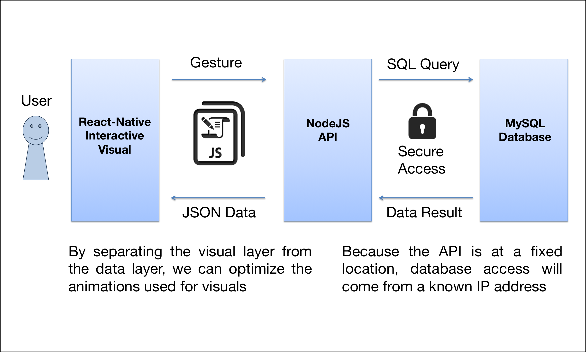
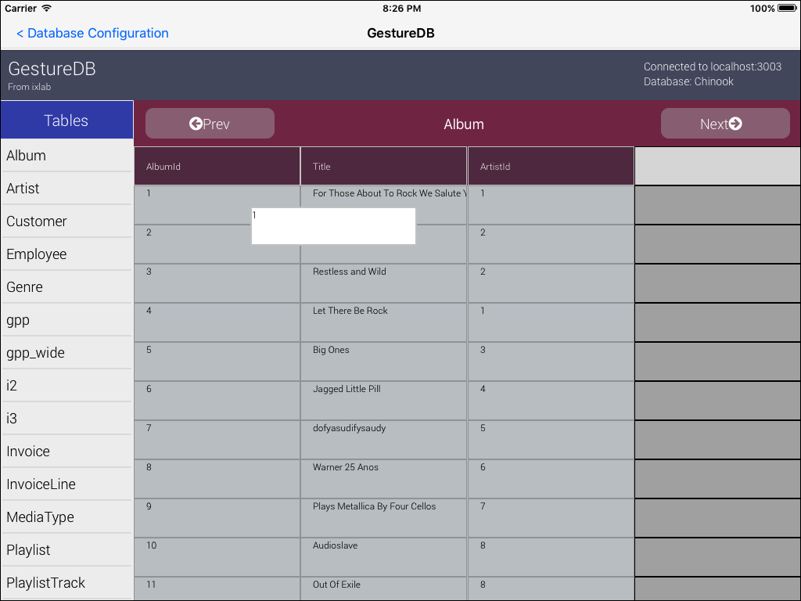

# Data Native - An Accessible & Touch-Guided iPad App for MySQL Database Browsing

This is a technical report on Data Native, which does not include setup instructions. These can be found on (our website)[http://dannyflax.github.io/Data-Native/].

We present Data Native, a responsive and efficient iPad App that maps SQL queries to familiar touch gestures such as swiping or dragging on individual data objects in the database. Data Native makes database browsing more accessible by applying mobile-specific interface and navigation techniques to create a familiar interactive experience for exploring unfamiliar data sets.

## Why another database tool?

Existing interfaces for direct database browsing and manipulation fail to meet the intuitive standards set forth by many of the applications we use on mobile devices today. Given the massive amount of data at our disposal compared to the sparse amount of tools available to efficiently analyze it, an innovative tool that takes advantage of touch-based interfaces has the potential to trigger leaps in data analysis that were not possible before. The key is finding a way to apply mobile-specific interface and navigation techniques to enhance the user's database exploration experience. This task is challenging because it is not intuitive which properties of a touchable interface impact usability, and so it is unclear exactly how these properties can be applied to form database queries. Data Native uses the ideas set forth in [1] to create an accessible touch-guided interface for MySQL database browsing. This application maps SQL queries to familiar touch gestures such as swiping or dragging on individual data objects in the database. By using React Native's development platform, we were able to develop a responsive and efficient native interface. We also address necessary design considerations, such as data security, animation optimization, and avoidance of query repetition.

# Relevant Work

Prior work has explored the usage of touch screens as part of an interactive data system. SnapToQuery has demonstrated the importance of visual feedback and component responsiveness in  exploration interfaces, touch or otherwise [2]. dbTouch explores the usage of gestures to sample a data set and manipulate its granularity [3]. dbTouch discusses some of the challenges with touch-based exploration architectures, though it lacks sophisticated visualization specifications. Gestural Query Specification articulates a complete platform for real-time touch-guided exploration of relational databases but does not consider the specific design needs of a robust mobile application [1]. This work explores these considerations.

# Implementation Details

The main contribution of this work is the application implementation. In this section, we give an overview of our implementation and list specific details that allow Data Native to provide an intuitive and natural data exploration experience.

## Application Overview

Data Native plugs right into an existing database. Our current implementation supports 3 different exploratory gestures which can be used applied repeatedly to produce new data sets. Each gesture manipulates data at table-level granularity. The gestures and their associated query implementations are shown in Figure 1 below, as applied to a sample data table.

**1. Sort** - By swiping right or left on a column header, the user may sort the data set (i.e. add an “order by” qualifier) by ascending or descending order of data in the chosen column.

**2. Filter** – By dragging and dropping a data block from the data set to a column header, the user may filter the data according to a specific value (e.g. "select * from table where EmployeeID = 1").

**3. Aggregate** – By dragging and dropping a column header to the main table header, the user can initiate an aggregation. This will group together rows that have the same value for this column.
After selecting the grouping column, the user chooses how to combine the other columns in the row. The choices are MAX, MIN, COUNT, or SUM.

## System Architecture

Data Native consists of a client-side iPad application and a standalone server application that sit on top of the database. An overview of the architecture is shown in Figure 2 below. 

Below are more specific details about each layer.

### NodeJS Server

We implemented a RESTful NodeJS API that negotiates all database connections from a single point. Users can enter their MySQL access information (login, host, port) for one or more existing MySQL servers. The client will then be able to connect to any of the MySQL servers listed and begin exploring. The server accepts query requests from the client in the form of JSON and transforms them into SQL code. The result of each query is then returned as JSON and limited by a number imposed within the client's request. Storing the login information on the server is advantageous because it prevents the need to send credentials over HTTP or HTTPS. It also limits the amount of remote database access capabilities necessary to grant because all database access comes from a single point. Likewise, access is easy to monitor from just one connection site.

### React Native Client

The choice of front-end platform was somewhat difficult because we needed a platform that allowed for rapid style and layout development, and developing with native Objective-C code would not meet this requirement. We also wished to achieve animations that responded properly to touch and gestures, so a web application was not possible either. We chose Facebook's React Native platform because it was the best available combination of native and web [4]. React Native interprets JavaScript interface code and renders it using native Cocoa UI elements, allowing us to retain the native feel while writing significantly less code than would be necessary with Objective-C. Other perks of using React Native include simple flexbox layout tools, data compatibility with the NodeJS Server, and an optimized animations library.

## Optimizations

Below are optimizations we implemented that work specifically for our architecture stack.

### Optimized Animations Library

With React-Native’s ‘Animated’ library, we were able to create visual feedback for our custom gesture components that is just as responsive as the standard Cocoa components. Animated handles object position interpolation in a high-performance manner by executing these computations independently from the normal JavaScript event loop. Without this optimization, Gestures would be burdensome or frustrating to use due to slower animation times.

### Views Instead of Nested Queries

Views are pointers to specific data sets within database which store the state of the data after a query has been performed. We use Views to store the results of a query so that any successive queries can just be performed on the view. This way, we prevent the needless repetition of long and complicated queries at the cost of taking up more space in the database.

### State-Controlled Data Rendering

Table data is stored in React as a state variable, meaning that when it is updated by the API, only the parts of the data that have been changed get re-rendered. This data flow is useful because it allows for an easy visual transition between different data sets. It also simplifies the process of handling an influx of new data on the client.

# Evaluation

We chose to evaluate our system by testing how closely it matched Apple's iOS Design Guidelines [5]. Since the goal of this application was to create a familiar experience, we figured this was a reasonable place to start assessing how well we met this goal. 

## Deference, Clarity, and Depth

The very first qualities Apple suggests that apps should embody are deference, clarity, and depth.
They define them as follows:

**Deference** - "The UI helps people understand and interact with the content, but never competes with it."

Our exploration interface is simplistic. The table headings indicate how the database is structured, but they are far apart enough from the data itself that the information can be read clearly. All backgrounds consist of solid colors and all content is in the form of text, so there is no fear of the UI competing with the content. 

**Clarity** - "Text is legible at every size, icons are precise and lucid, adornments are subtle and appropriate, and a sharpened focus on functionality motivates the design."

The smallest font size we used is 12pt, which surpasses the minimum clarity requirement of 11pt. Our interface also uses contrasting colors (e.g. white on purple, black on white) that make the text clear and legible. By contrasting colors between the table content (i.e. rows) and the headers (i.e. schema), we make the exploratory functionality clear. The gestures, however, are not immediately made apparent by the UI, despite the fact that they are simple once learned. 

**Depth** - "Visual layers and realistic motion impart vitality and heighten people’s delight and understanding."

We achieve depth in our animations by darkening the table content below the selected cell during a filter or aggregation gesture. This is demonstrated in the figure below. The darkened overlay draws attention away from the data not in use and creates the illusion of the cell hovering above the rest of the table. In addition to this effect, we take advantage of React Native's Animated library here to make the physical motion responsive and realistic. Figure 3 below demonstrates this effect.

## Interactivity and Feedback

Each one of our custom gesture components embodies interactivity and feedback. The key was to keep the UI response actions separated from potentially blocking data handling code. For each event that required a call to the database, we placed the UI activity indicator on a separate thread using the Animated library. Doing so gives the user an immediate response, even if the query does not execute and update the data set instantaneously. Since our architecture does not handle query latency, this was the best way to still provide an interactive experience. Future work should explore.  All other elements (buttons, navigation, forms, etc.) consist of native iOS components and so they provide the same feel as other applications. 

## Adaptivity and Layout

We are working towards creating a fully adaptive interface that will work for any device. Due to size considerations, our interface will only support tablet screens. However, we still want to support any device in the vast array of tablets currently available. React Native's flexbox layout system naturally makes our layout adaptive because absolute sizes and positions are rarely, if ever, specified. Unfortunately, this made collision detection for drag and drop a bit more difficult. React Native presently does not have the capacity to automatically compute absolute layout positions, despite the fact that touch coordinates are absolute. Thus syncing the two required processing each individual layer in the layout to compute absolute bounding boxes. This solution is not incredibly scalable for major interface changes, but it makes our original interface design adaptive.

# Conclusion

Our results demonstrate that efficient and intuitive database exploration on devices without keyboards can be done. Overall, the application provides for quick and responsive generation of complicated queries, all of which can be explored and applied to a live MySQL database over a cellular network. We anticipate Data Native to be a starting point for expansion of data analytics into devices that provide a more immersive user experience. The concept of mapping gestures to queries can also be applied to newer devices, such as Oculus Rift and Myo, so as to make data analytics and discovery a more natural experience. Future work should also explore the adaptation of such an interface to smaller phone screens. If we can make data exploration accessible to more users, large data sets can be explored with new perspective, potentially opening brand new market possibilities. 

# References

[1] A. Nandi. Querying Without Keyboards. CIDR, 2013.

[2] L. Jiang and A. Nandi. Snaptoquery: providing interactive feedback during exploratory query specification. Proceedings of the VLDB Endowment, 8(11):1250–1261, 2015.

[3] S. Idreos and E. Liarou. dbtouch: Analytics at your fingertips. In CIDR, 2013.

[4] https://facebook.github.io/react-native/

[5] https://developer.apple.com/library/ios/documentation/UserExperience/Conceptual/MobileHIG/
