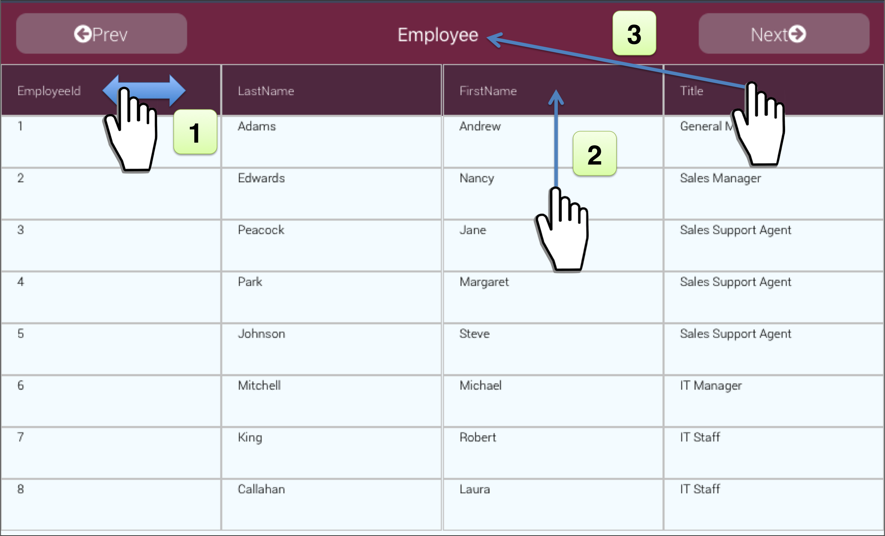

# Data Native - An Accessible & Touch-Guided iPad App for MySQL Database Browsing

Data Native is an iPad App that enables database exploration without writing a single line of code. Scanning through large data sets becomes as simple as swiping, dragging, and dropping. 

## Overview

Data Native plugs right into an existing database. Our current implementation supports 3 different exploratory gestures which can be used applied repeatedly to produce new data sets. Each gesture manipulates data at table-level granularity. The gestures and their associated query implementations are shown in Figure 1 below, as applied to a sample data table.

**1. Sort** - By swiping right or left on a column header, the user may sort the data set (i.e. add an “order by” qualifier) by ascending or descending order of data in the chosen column. This will append an ORDER BY clause to the current query. 

**2. Filter** – By dragging and dropping a data block from the data set to a column header, the user may filter the data according to a specific value. This is equivalent to "SELECT * FROM table WHERE column=value".

**3. Aggregate** – By dragging and dropping a column header to the main table header, the user can initiate an aggregation. This will group together rows that have the same value for this column.
After selecting the grouping column, the user chooses how to combine the other columns in the row by dragging a second column to a function value. The choices are MAX, MIN, COUNT, or SUM. This is equivalent to "SELECT column1,MAX(column2) GROUP BY column1"

